# Mapa completo del flujo conversacional del bot

Documento de referencia detallado sobre cómo viaja un mensaje desde `POST /chat` hasta la respuesta, qué funciones intervienen en cada nodo y en qué orden se aplican heurísticas, LLM y consultas a base de datos.

Para una vista de arquitectura general ver [architecture.md](architecture.md). Para el autómata de estados simplificado ver [state-automata.md](state-automata.md).

---

## Leyenda de patrones

| Símbolo | Significado |
|---------|-------------|
| **H** | Heurística determinista: señales de texto, regex, lectura de banderas de estado |
| **L** | Llamada LLM: clasificador JSON o generador de texto |
| **DB** | Consulta a MySQL o API del backend CRM/catálogo |

| Patrón compuesto | Significado |
|------------------|-------------|
| **H → L** | Heurística primero; si no resuelve, se llama al LLM |
| **L + H** | LLM primero; heurística corrige, fusiona o hace fallback |
| **H \| L** | Cualquiera de los dos puede disparar la acción (OR lógico) |
| **H gate → L** | Heurística decide si vale la pena invocar el LLM |

---

## 1. Entrada HTTP y precondiciones

Archivo: [`bot/src/server.py`](../src/server.py)

Antes de invocar el grafo, el servidor valida sesión, permisos CRM y banderas de control.

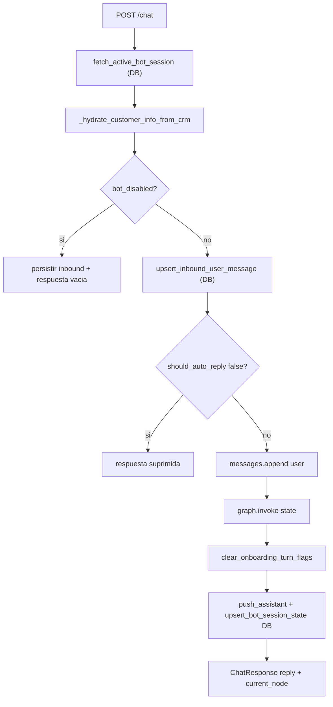

| Paso | Función | Tipo | Notas |
|------|---------|------|-------|
| Carga sesión | `fetch_active_bot_session` | DB | Deserializa `state_payload` de `bot_sessions` |
| Hidratación nombre | `_hydrate_customer_info_from_crm` | H | Completa `customer_info.nombre` desde CRM |
| Silencio total | `bot_disabled` | H | No invoca grafo ni LLM |
| Handoff CRM | `should_auto_reply is False` | H | Persiste inbound, no responde |
| Turno activo | `graph.invoke` | — | Ejecuta nodos en cadena según transiciones |
| Limpieza | `clear_onboarding_turn_flags` | H | Borra `onboarding_welcome_sent_this_turn` tras el turno |
| Salida | `_collect_tail_ai_messages` | H | Une mensajes assistant con `<<BOT_MSG_BREAK>>` |

---

## 2. Grafo LangGraph completo

Archivo: [`bot/src/graph.py`](../src/graph.py)

Cada `invoke` recorre **uno o más nodos** en el mismo turno hasta llegar a `END`. El orden de entrada es siempre:

```
START → customer_onboarding → intent_checker → (router | faq | nodo activo) → …
```

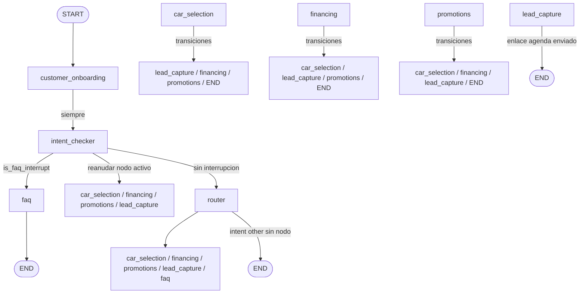

### Funciones de enrutamiento condicional (`_route_*`)

| Función | Nodo origen | Lee en estado | Destinos posibles |
|---------|-------------|---------------|-------------------|
| `_route_after_customer_onboarding` | `customer_onboarding` | — | `intent_checker` |
| `_route_after_intent_checker` | `intent_checker` | `current_node`, `is_faq_interrupt` | `faq`, `router`, `lead_capture`, `car_selection`, `financing`, `promotions` |
| `_route_from_router` | `router` | `current_node` | `car_selection`, `lead_capture`, `faq`, `financing`, `promotions`, `END` |
| `_route_after_car_selection` | `car_selection` | `current_node` | `lead_capture`, `financing`, `promotions`, `END` |
| `_route_after_financing` | `financing` | `current_node` | `car_selection`, `lead_capture`, `promotions`, `END` |
| `_route_after_promotions` | `promotions` | `current_node` | `car_selection`, `financing`, `lead_capture`, `END` |
| `_route_after_lead_capture` | `lead_capture` | `current_node` | `promotions`, `financing`, `car_selection`, `END` |

**Nota importante:** cuando un nodo de dominio cambia `current_node` a otro nodo **sin generar respuesta** (solo redirección), el grafo continúa en el mismo `invoke` y ejecuta el nodo destino en cadena.

---

## 3. Detalle por nodo

### 3.1 `customer_onboarding`

Archivo: [`bot/src/nodes/customer_onboarding.py`](../src/nodes/customer_onboarding.py)

**Propósito:** gate de bienvenida inicial. Envía el texto literal de `welcomeMessage` una sola vez y cede el flujo a `intent_checker` sin clasificar intención.

**Patrón dominante:** **H** (lectura de bandera + setting; sin LLM).

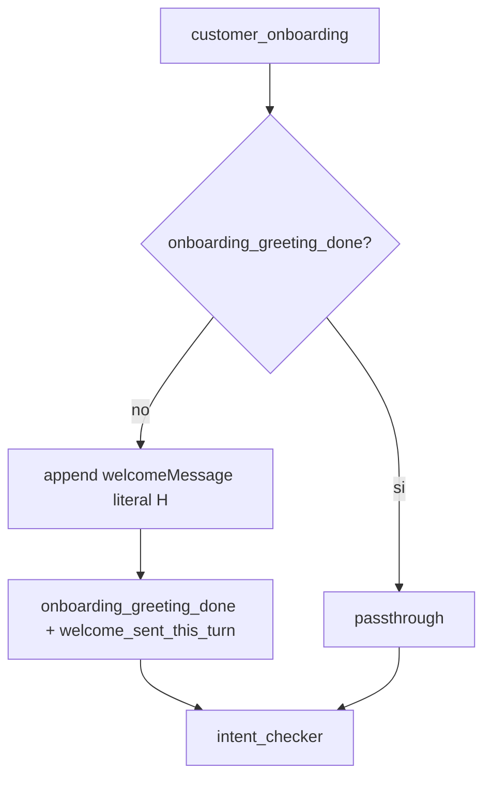

| Paso | Función | Tipo | Descripción |
|------|---------|------|-------------|
| 1 | `onboarding_greeting_done` | H | Si ya se envió bienvenida → passthrough |
| 2 | `_welcome_message_from_settings` | H | Lee `welcomeMessage` literal (fallback mínimo con `botName` si vacío) |
| 3 | `append_assistant_message` | H | Publica bienvenida y marca flags |
| Salida | `_route_after_customer_onboarding` | H | **Siempre** → `intent_checker` |

**Casos clave:**

- Primer turno → bienvenida literal + continúa a `intent_checker` (FAQ, catálogo, CTWA, etc. los decide el resto del grafo).
- Turnos siguientes con `onboarding_greeting_done` → no reenvía bienvenida.
- CTWA: el shortcut prepara vehículo/`current_node=car_selection` **sin** marcar greeting done; onboarding puede enviar bienvenida y `intent_checker` retoma `car_selection`.

---

### 3.2 `intent_checker`

Archivo: [`bot/src/nodes/intent_checker.py`](../src/nodes/intent_checker.py)

**Propósito:** detectar si el mensaje **interrumpe** un flujo comercial activo (FAQ, asesor humano, cita) antes de que el router reclasifique.

**Patrón dominante:** **L con overrides H** (clasificadores LLM primero; heurísticas corrigen casos conocidos).

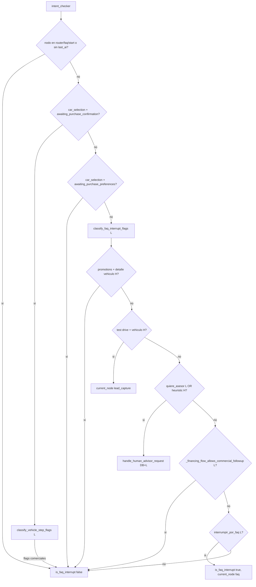

| Paso | Función | Tipo | Efecto |
|------|---------|------|--------|
| Early exit | nodo en `""`, `start`, `router`, `faq` o sin `last_ai` | H | No evalúa interrupción |
| Confirmación compra | `classify_vehicle_step_flags` | L | Si hay flags comerciales, no marca FAQ |
| FAQ interrupt | `classify_faq_interrupt_flags` | L | Flags: `interrumpir_por_faq`, `quiere_asesor_humano` |
| Promo + detalle | `_is_vehicle_detail_request` | H | Override: no FAQ en flujo promociones |
| Cita con vehículo | `is_test_drive_or_visit_request` | H | Redirige a `lead_capture` |
| Asesor humano | `flags.quiere_asesor_humano` \| `human_advisor_heuristic_match` | L \| H | Push CRM + ack; puede activar `suppress_commercial_node_once` |
| Navegación comercial en financing | `_financing_flow_allows_commercial_followup` | L | Bloquea desvío a FAQ durante selección de plan/vehículo |
| Decisión FAQ | `flags.interrumpir_por_faq` | L | Guarda `resume_to_step`, activa `skip_car_prompt` / `skip_lead_prompt` |

---

### 3.3 `router`

Archivo: [`bot/src/nodes/router.py`](../src/nodes/router.py)

**Propósito:** clasificar intención principal y asignar `current_node` + `intent`.

**Patrón dominante:** **H (banderas de estado) → L** (`classify_router_intent` como decisor principal de intención).

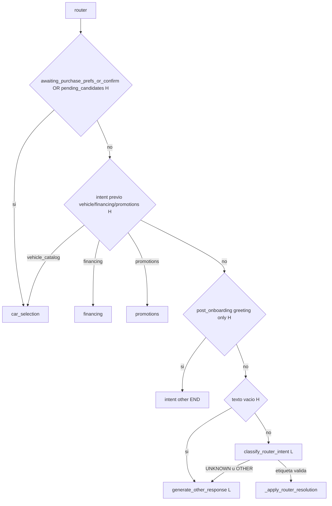

#### Fase 1 — Banderas de estado (sin LLM de clasificación)

| Orden | Condición | Destino |
|-------|-----------|---------|
| 1 | `awaiting_purchase_preferences`, `awaiting_purchase_confirmation` o `last_vehicle_candidates` | `car_selection` |
| 2 | `intent` previo `vehicle_catalog` / `financing` / `promotions` con texto | Mantiene nodo comercial |
| 3 | Saludo post-onboarding (`is_greeting_only_message`) | `intent=other`, END |
| 4 | Texto vacío | `generate_other_response` → END |

#### Fase 2 — Clasificador LLM

| Paso | Función | Tipo |
|------|---------|------|
| 1 | `_sanitize_previous_intent_for_classifier` | H | Evita sesgo `faq` → `other` en el prompt |
| 2 | `classify_router_intent` | L | Etiqueta: `VEHICLE_CATALOG`, `FAQ`, `FINANCING`, `PROMOTIONS`, `HUMAN_ADVISOR`, `OTHER` |
| 3 | `_apply_router_resolution` | H | Mapea etiqueta a `current_node` + `intent` |
| 4 | Etiqueta inválida o `UNKNOWN` | L | `generate_other_response` → `intent=other` |

**Notas:**

- No hay reconciliación heurística ni fallback determinista si el LLM falla: la etiqueta del clasificador (o `other`) define el destino.
- Escalación a asesor humano por heurística ocurre en `intent_checker`, no como early-exit en `router`.
- Si el clasificador devuelve `FAQ`, el flujo va a `faq` aunque el mensaje mencione vehículos; `car_selection` solo se alcanza con `VEHICLE_CATALOG` o banderas de contexto.

Etiquetas válidas del clasificador: `VEHICLE_CATALOG`, `FAQ`, `FINANCING`, `PROMOTIONS`, `HUMAN_ADVISOR`.

---

### 3.4 `faq`

Archivo: [`bot/src/nodes/faq.py`](../src/nodes/faq.py)

**Propósito:** responder preguntas del negocio usando candidatos FAQ de BD.

**Patrón dominante:** **DB + H → L** (contexto verificado primero; LLM redacta respuesta).

| Paso | Función | Tipo | Cuándo |
|------|---------|------|--------|
| 1 | `resolve_faq_candidates` | DB+H | `fetch_faq_candidates`; si tema ubicación → `fetch_location_faq_candidates` |
| 2 | `resolve_faq_follow_up` | H | Elige cierre según horarios/ubicación/general |
| 3 | `generate_faq_resume_transition` | L | Solo si `is_faq_interrupt` |
| 4 | `generate_faq_user_turn` | L | Cuerpo de respuesta + cierre |

**Modo interruptivo** (`is_faq_interrupt=True`):

- Genera transición de reanudación hacia `resume_to_step`.
- Restaura `current_node` al nodo guardado (`car_selection`, `financing`, etc.).
- Limpia `skip_car_prompt` / `skip_lead_prompt`.
- El grafo termina en `END` de `faq`; el **siguiente turno** retoma el flujo comercial.

**Modo standalone** (entrada directa desde router):

- `current_node` vuelve a `router` tras responder.
- `intent` queda en `other`.

---

### 3.5 `car_selection`

Archivo: [`bot/src/nodes/car_selection.py`](../src/nodes/car_selection.py)

**Propósito:** explorar catálogo, filtrar, seleccionar vehículo, mostrar detalle, imágenes, comparar y confirmar compra.

**Patrón dominante:** **H por rama** con **L en pasos de confirmación y selección ambigua**.

#### Entrada y guardas

| Guarda | Tipo | Efecto |
|--------|------|--------|
| `suppress_commercial_node_once` | H | Salta ejecución (post-ack asesor) |
| `skip_car_prompt` | H | Salta ejecución (turno FAQ interrumpido) |
| `fetch_vehicles` | DB | Carga catálogo completo |

#### Sub-flujo A0: preferencias de compra (`awaiting_purchase_preferences`)

Tras seleccionar un vehículo (`_respond_with_vehicle_detail`), el bot **no** muestra aún la narrativa de detalle ni el PDF. Primero pide:

1. Transmisión (`automatico` / `estandar`)
2. Tipo de pago (`contado` / `financiado`)

| Orden | Función | Tipo |
|-------|---------|------|
| 0 | `classify_vehicle_step_flags` | L — escapes: `wants_other_vehicles` / `reject_purchase` → catálogo |
| 1 | `detect_transmission_preference` / `detect_payment_type_preference` | H |
| 2 | `classify_purchase_preferences` | L (si hay conflicto o ambigüedad) |
| 3 | Completas → `_respond_with_selected_vehicle_detail_and_purchase_question` | L narrativa |

Campos: `selected_transmission`, `selected_payment_type`, `awaiting_purchase_preferences`.

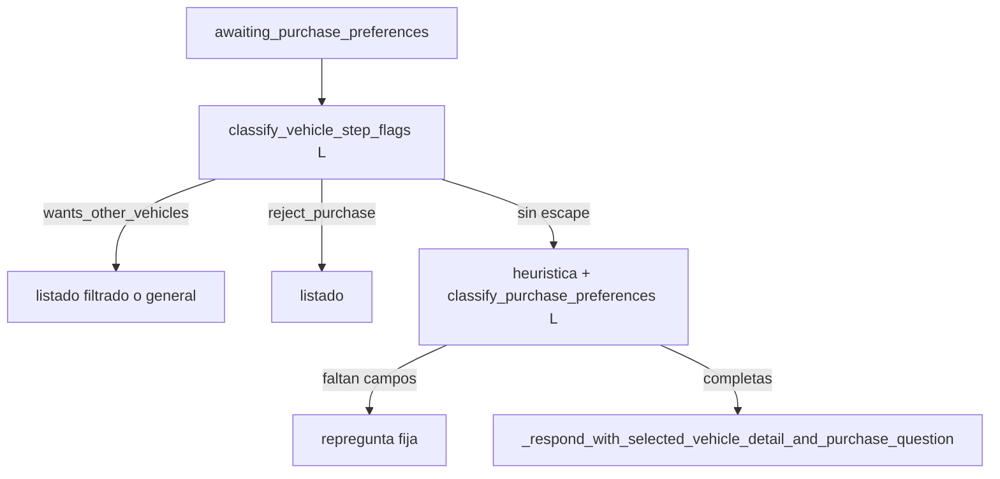

#### Sub-flujo A: preferencia de contacto (`awaiting_purchase_confirmation`)

Al completar preferencias se envía la **narrativa** de detalle + mensaje fijo de preferencia de contacto (WhatsApp / llamada / cita). El **PDF** de ficha técnica (`technicalSheetUrl` → `<<WC_DOCUMENT_JSON>>` o link web) **no** se adjunta aquí.

El PDF solo se envía cuando:

1. Pedido explícito (`user_asks_for_technical_sheet` en `car_selection_fallback`), o
2. Pedido de imágenes (`ask_images` / `ask_more_images` / `VER_MAS_IMAGENES`) → imágenes **y** PDF si hay URL y aún no se entregó para ese `vehicle_id` (re-pedido explícito de ficha sí permite reenvío).

Tracking: `technical_sheet_delivered_vehicle_id` (se resetea al cambiar de vehículo).

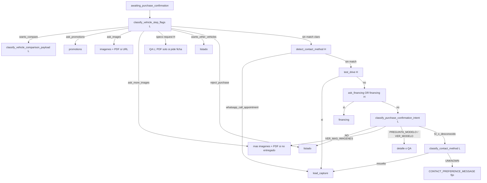

En `lead_capture`: `whatsapp`/`call` → "Perfecto! gracias"; `appointment` → link de calendario. Se persiste `contact_method` en el lead.
#### Sub-flujo B: selección de candidatos pendientes (`last_vehicle_candidates`)

| Orden | Función | Tipo |
|-------|---------|------|
| 1 | `canonicalize_with_typo_support` (nombre) | H |
| 2 | Regex índice explícito (`opción 2`, solo dígito) | H |
| 3 | `extract_vehicle_pending_selection_payload` | L (fallback) |
| 4 | `_respond_pending_selection_clarification` | L | Si hay ambigüedad |

#### Sub-flujo C: comparación de vehículos

| Orden | Función | Tipo |
|-------|---------|------|
| 1 | `_should_invoke_vehicle_comparison_llm` | H gate |
| 2 | `classify_vehicle_comparison_payload` | L |
| 3 | `generate_vehicle_comparison_conversation` | L |

#### Sub-flujo D: búsqueda y listado general

| Orden | Función | Tipo |
|-------|---------|------|
| 1 | `is_general_request` | H | → listado agrupado |
| 2 | `is_financing_request` / `is_promotions_request` | H | → redirige sin respuesta |
| 3 | `detect_vehicle_filters` | H | → búsqueda filtrada |
| 4 | `looks_like_specific_vehicle_request` | H | → listado con aviso de no disponible |
| 5 | `_respond_available_list` / `_respond_with_filtered_search` | H+L | Formatters + `generate_verified_user_message` |

#### Transiciones de grafo (sin mensaje en el nodo)

| Destino | Disparadores |
|---------|--------------|
| `lead_capture` | `confirm_purchase`, test drive, `decision == SI` |
| `financing` | `ask_financing`, señales de crédito |
| `promotions` | `ask_promotions`, señales de ofertas |

---

### 3.6 `financing`

Archivo: [`bot/src/nodes/financing.py`](../src/nodes/financing.py)

**Propósito:** listar planes, seleccionar plan, elegir vehículo dentro del plan y avanzar a compra.

**Patrón dominante:** **L primero** (`classify_financing_step_flags` al inicio de cada turno).

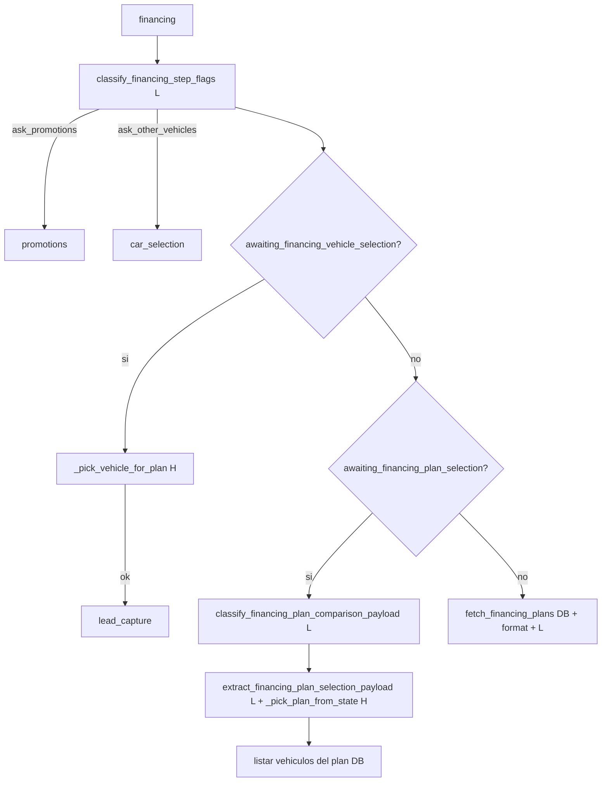

#### Sub-estados

| Banderas | Flujo principal | H/L |
|----------|-----------------|-----|
| `awaiting_financing_plan_selection` | Comparar planes → seleccionar plan → vehículos del plan | L → L → H fallback → DB |
| `awaiting_financing_vehicle_selection` | Elegir vehículo por nombre/número | H → `lead_capture` |
| Sin banderas | Listar planes generales o por vehículo seleccionado | DB → L |

#### Selección de plan (detalle H/L)

| Orden | Función | Tipo |
|-------|---------|------|
| 1 | `step_flags.select_plan` | L |
| 2 | `extract_financing_plan_selection_payload` | L |
| 3 | `classify_financing_plan_selection_intent` (plan único) | L |
| 4 | `_pick_plan_from_state` | H (fallback) |

---

### 3.7 `promotions`

Archivo: [`bot/src/nodes/promotions.py`](../src/nodes/promotions.py)

**Propósito:** listar promociones, aplicar explícitamente, elegir vehículo aplicable y confirmar interés.

**Patrón dominante:** **L primero** (`classify_promotions_step_flags` al inicio).

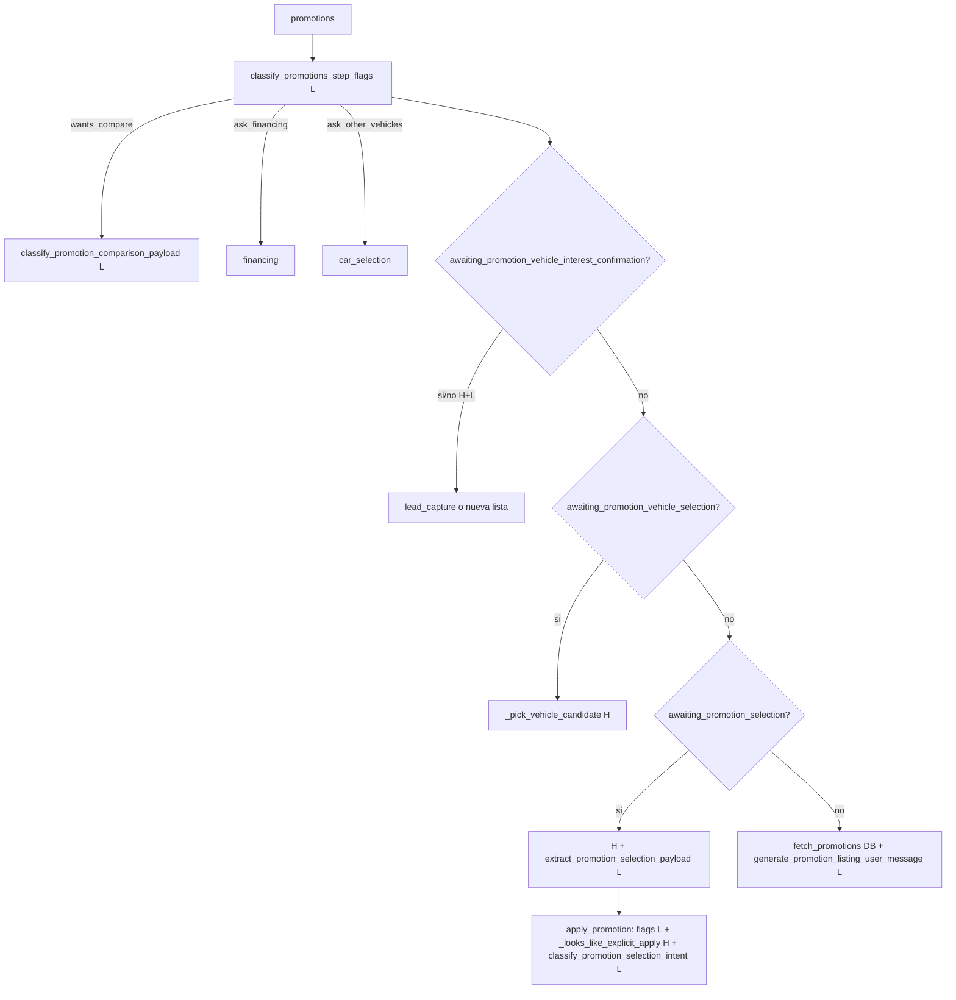

#### Confirmación de aplicar promoción

Orden documentado en código:

1. Señal LLM `apply_promotion` (flags)
2. Heurística local `_looks_like_explicit_apply`
3. Clasificador auxiliar `classify_promotion_selection_intent` (promoción única)

#### Sub-estados

| Banderas | Acción |
|----------|--------|
| `awaiting_promotion_selection` | Elegir promo de lista numerada |
| `awaiting_promotion_apply_confirmation` | Resumen + pedir confirmación explícita |
| `awaiting_promotion_vehicle_selection` | Elegir vehículo aplicable |
| `awaiting_promotion_vehicle_interest_confirmation` | Sí/No con señales H + flags L |

---

### 3.8 `lead_capture`

Archivo: [`bot/src/nodes/lead_capture.py`](../src/nodes/lead_capture.py)

**Propósito:** compartir enlace de agenda, notificar al asesor y desactivar el bot.

**Patrón dominante:** **L para navegación y mensaje**; **DB/API sin LLM** para notificación.

| Paso | Función | Tipo | Efecto |
|------|---------|------|--------|
| 1 | `suppress_commercial_node_once` | H | Salta si ack de asesor reciente |
| 2 | `lead_capture_done` | H | Mensaje de ya completado |
| 3 | Sin `selected_car` | H+L | Pide elegir vehículo primero |
| 4 | `classify_lead_capture_navigation` | L | Override a promotions/financing/car_selection |
| 5 | `generate_lead_capture_scheduling_message` | L | Texto con enlace calendario |
| 6 | `notify_advisor` + `push_event_to_backend` | DB/API | Notifica owner |
| 7 | `deactivate_bot` | H | `bot_disabled=True` |

Tras éxito: `lead_capture_done=True`, turnos futuros no invocan el grafo.

---

### 3.9 Escalación a asesor humano

Archivo: [`bot/src/utils/human_advisor_notify.py`](../src/utils/human_advisor_notify.py)

| Punto de entrada | Disparador | Tipo |
|------------------|------------|------|
| `router` (resolución) | etiqueta `HUMAN_ADVISOR` del clasificador | L |
| `intent_checker` | `quiere_asesor_humano` \| `human_advisor_heuristic_match` | L \| H |

`handle_human_advisor_request`:

1. Idempotente por `human_advisor_push_sent`
2. `push_event_to_backend` (DB)
3. `notify_advisor` (API)
4. Mensaje ack al usuario (texto fijo, sin LLM)
5. Opcionalmente `deactivate_bot`

Si se invoca desde `intent_checker` durante un flujo comercial y agrega mensaje nuevo → activa `suppress_commercial_node_once` para que el nodo comercial no duplique respuesta en el mismo `invoke`.

---

## 4. Flujos transversales

### 4.1 FAQ interruptiva (multi-turno)

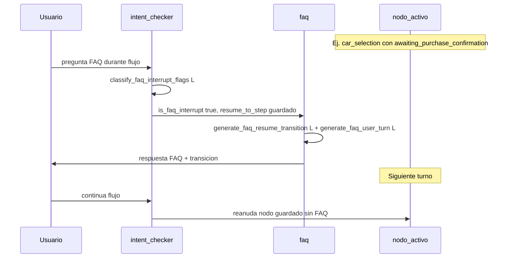

### 4.2 Onboarding con intención comercial

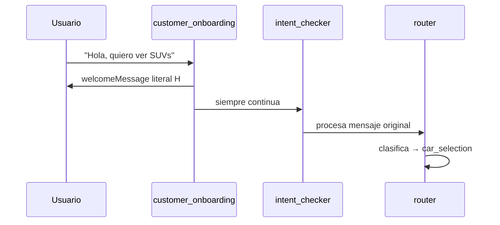

### 4.3 Handoff y bot desactivado

| Evento | Banderas resultantes | Efecto en turnos siguientes |
|--------|---------------------|------------------------------|
| `lead_capture` completado | `lead_capture_done`, `bot_disabled` | `/chat` persiste inbound, `reply=""` |
| Asesor humano (con deactivate) | `human_advisor_requested`, `bot_disabled` | Igual |
| CRM `should_auto_reply=false` | — | Respuesta suprimida sin desactivar sesión bot |

---

## 5. Matriz resumen H/L por nodo

| Nodo | ¿Quién va primero? | Clasificación | Generación de texto | Datos |
|------|-------------------|---------------|---------------------|-------|
| `server` | H | — | — | DB |
| `customer_onboarding` | H | — | H (welcomeMessage literal) | settings |
| `intent_checker` | H (early exit) → L | L | L (ack asesor, fijo) | DB evento asesor |
| `router` | H (banderas) → L | L (`classify_router_intent`) | L (`other`) | — |
| `faq` | DB + H | — | L | DB FAQ |
| `car_selection` | H por rama; L en confirmación | L (flags, compra, comparación, pending) | L (detalle, QA, listados) | DB catálogo/imágenes |
| `financing` | L (flags) → H fallback | L | L | DB planes |
| `promotions` | L (flags) → H auxiliar | L | L | DB promociones |
| `lead_capture` | H (guardas) → L | L (navegación) | L (agenda) | DB/API notify |
| `human_advisor` | H \| L | — | H (ack fijo) | DB/API |

---

## 6. Banderas de estado más relevantes

Archivo: [`bot/src/state.py`](../src/state.py)

| Bandera | Controla |
|---------|----------|
| `current_node` | Enrutamiento del grafo y `_route_*` |
| `intent` | Contexto para router y reanudación |
| `onboarding_greeting_done` | Bienvenida inicial ya enviada |
| `onboarding_welcome_sent_this_turn` | Evita duplicar bienvenida en router el mismo invoke |
| `is_faq_interrupt` | Modo FAQ interruptiva |
| `resume_to_step` | Nodo a restaurar tras FAQ |
| `skip_car_prompt` / `skip_lead_prompt` | Saltar nodo en turno interrumpido |
| `suppress_commercial_node_once` | Saltar nodo comercial tras ack asesor |
| `awaiting_purchase_preferences` | Espera transmisión + tipo de pago tras seleccionar vehículo |
| `selected_transmission` / `selected_payment_type` | Preferencias capturadas antes del detalle |
| `awaiting_purchase_confirmation` | Sub-flujo de cierre: espera preferencia de contacto post-detalle |
| `contact_method` | Preferencia de contacto: `whatsapp` \| `call` \| `appointment` |
| `technical_sheet_delivered_vehicle_id` | PDF de ficha ya enviado (solo bajo pedido o junto a imágenes) |
| `last_vehicle_candidates` | Lista pendiente de desambiguar |
| `awaiting_financing_plan_selection` | Esperando elección de plan |
| `awaiting_financing_vehicle_selection` | Esperando vehículo dentro del plan |
| `awaiting_promotion_selection` | Esperando elección de promoción |
| `awaiting_promotion_apply_confirmation` | Esperando confirmación de aplicar |
| `lead_capture_done` / `bot_disabled` | Handoff completado |

---

## 7. Referencias cruzadas

| Archivo | Contenido |
|---------|-----------|
| [`bot/src/graph.py`](../src/graph.py) | Wiring del StateGraph y funciones `_route_*` |
| [`bot/src/state.py`](../src/state.py) | Contrato `clientState` |
| [`bot/src/server.py`](../src/server.py) | Ciclo HTTP `/chat` |
| [`bot/src/services/llm_responses.py`](../src/services/llm_responses.py) | Inventario de funciones L (clasificadores y generadores) |
| [`bot/src/utils/signals.py`](../src/utils/signals.py) | Constantes de señales heurísticas |
| [`bot/src/services/car_selection_fallback.py`](../src/services/car_selection_fallback.py) | Helpers H reutilizados en nodos comerciales |
| [`bot/src/utils/state_helpers.py`](../src/utils/state_helpers.py) | `latest_user_message`, `is_faq_intent`, append mensajes |

### Funciones LLM por categoría

| Categoría | Funciones en `llm_responses.py` |
|-----------|--------------------------------|
| Router / onboarding | `classify_router_intent`, `generate_other_response` |
| Interrupciones | `classify_faq_interrupt_flags`, `classify_vehicle_step_flags` |
| FAQ | `generate_faq_user_turn`, `generate_faq_resume_transition` |
| Vehículos | `classify_vehicle_comparison_payload`, `classify_purchase_confirmation_intent`, `classify_purchase_preferences`, `extract_vehicle_pending_selection_payload`, `generate_vehicle_*` |
| Financiamiento | `classify_financing_step_flags`, `classify_financing_plan_comparison_payload`, `extract_financing_plan_selection_payload`, `classify_financing_plan_selection_intent` |
| Promociones | `classify_promotions_step_flags`, `classify_promotion_comparison_payload`, `extract_promotion_selection_payload`, `classify_promotion_selection_intent` |
| Lead | `classify_lead_capture_navigation`, `generate_lead_capture_scheduling_message` |
| Genérico | `generate_verified_user_message` (usado en múltiples nodos) |
