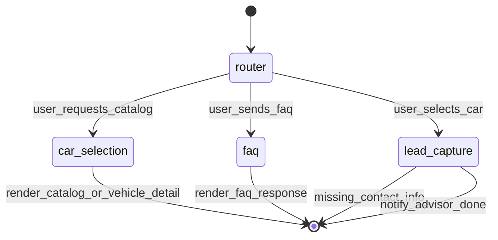

# Autómata de estados del bot

Este documento define el diagrama de estados del flujo conversacional.

## Estados

- `router`: evaluacion del contexto actual.
- `car_selection`: seleccion de modelo.
- `lead_capture`: captura de datos de contacto.
- `faq`: respuesta corta de preguntas frecuentes.

## Eventos principales

- `user_requests_catalog`: usuario pide ver disponibles o usar filtros.
- `user_selects_car`: usuario elige un modelo del listado.
- `user_sends_faq`: usuario hace pregunta general.
- `user_sends_contact_info`: usuario comparte `nombre`, `telefono`, `email`.

## Diagrama

## Condiciones de transicion

- `router -> car_selection`:
  - cuando detecta intencion de catalogo de vehiculos o hay contexto pendiente.
- `router -> lead_capture`:
  - cuando `selected_car` existe o el ultimo mensaje coincide con un modelo valido.
- `router -> faq`:
  - cuando detecta intencion FAQ (`faq`, `pregunta`, `info`, `informacion`).

## Contrato para frontend

- `current_node` indica la etapa activa del flujo.
- `reply` contiene el texto listo para mostrarse al usuario.
