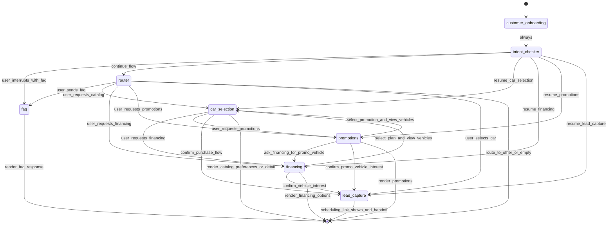

# Autómata de estados del bot

> Mapa completo con funciones internas y orden heurística/LLM por nodo: [flujo-completo.md](flujo-completo.md).

Este documento define el diagrama de estados del flujo conversacional actual. El grafo arranca en `customer_onboarding` (no en `intent_checker`).

## Estados

- `customer_onboarding`: gate de bienvenida (`welcomeMessage` literal una vez); siempre continúa a `intent_checker`.
- `intent_checker`: detecta si la entrada interrumpe un flujo activo con FAQ.
- `router`: clasifica la intencion principal y decide nodo destino.
- `car_selection`: explora catalogo, filtra, compara dos vehiculos (sin cambiar `selected_vehicle_id` hasta nueva eleccion), captura preferencias de transmision/pago y permite avanzar a compra. La narrativa de detalle se muestra tras preferencias; el PDF de ficha tecnica solo bajo pedido explicito o junto a un pedido de imagenes.
- `financing`: consulta planes financieros y cruza con vehiculos.
- `promotions`: consulta promociones y cruza con vehiculos aplicables.
- `lead_capture`: comparte enlace de Google Calendar para agendar prueba de manejo o visita, notifica al asesor y desactiva el bot.
- `faq`: resuelve preguntas puntuales del usuario.

## Eventos principales

- `user_interrupts_with_faq`: pregunta FAQ durante un flujo activo.
- `user_requests_catalog`: usuario pide ver inventario o filtrar vehiculos.
- `user_requests_financing`: usuario pregunta por pagos, credito o enganche.
- `user_requests_promotions`: usuario pregunta por promociones o descuentos.
- `user_selects_car`: usuario confirma interes en un vehiculo (luego preferencias transmision/pago antes del detalle).
- `user_confirms_visit_interest`: usuario confirma interes en prueba de manejo o visita (desde car_selection/financing/promotions).
- `user_asks_images_or_technical_sheet`: pedido de fotos (LLM) o ficha PDF (heuristica); las fotos co-envian el PDF si hay URL.

## Diagrama

## Condiciones de transicion

- `customer_onboarding -> intent_checker`:
  - siempre, tras enviar bienvenida si faltaba o en passthrough.
- `intent_checker -> faq`:
  - cuando detecta FAQ interruptiva y guarda `resume_to_step`.
- `router -> car_selection`:
  - cuando detecta catalogo o existe contexto pendiente de seleccion.
- `router -> financing`:
  - cuando detecta señales de credito, pagos o financiamiento.
- `router -> promotions`:
  - cuando detecta intencion de promociones/descuentos.
- `router -> lead_capture`:
  - cuando existe seleccion de vehiculo para continuar compra.
- nodos de dominio (`car_selection`, `financing`, `promotions`):
  - pueden terminar turno (`END`) o redirigir segun el estado actualizado.

## Contrato para frontend

- `current_node` indica la etapa activa tras cada turno.
- `reply` contiene el texto listo para mostrarse al usuario.

