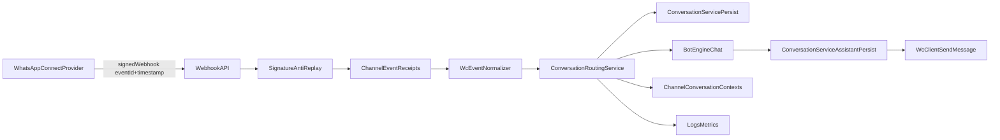

# WhatsApp Connect V2 - Integracion E2E

## Objetivo
Habilitar el canal `whatsapp` con proveedor `whatsapp-connect` en modo productivo multi-tenant, sin exponer credenciales al frontend y reutilizando el sistema existente de integraciones (`ChannelIntegration` / `ChannelCredential`).

## Arquitectura propuesta



## Flujo paso a paso

### 1) Inbound webhook
1. WC envia `POST /api/webhooks/whatsapp-connect/events`.
2. Backend resuelve integracion por `deviceId` y obtiene secreto desde `ChannelCredential` cifrada.
3. Middleware valida firma HMAC (`x-wc-signature`) y timestamp (`x-wc-timestamp`).
4. Middleware anti-replay valida ventana temporal.
5. Se registra idempotencia en `channel_event_receipts`.
6. Si evento no es `message.inbound`, se marca `ignored` y termina.

### 2) Procesamiento bot
1. `WcEventNormalizer` transforma payload externo al DTO interno.
2. `ConversationService` persiste mensaje inbound en `ClientLead`, `Conversation`, `Message`.
3. Si `shouldAutoReply=true`, backend invoca `POST {BOT_ENGINE_URL}/chat`.
4. Cada respuesta del bot se persiste como `assistant`.

### 3) Outbound
1. Backend envia respuestas con `wcClient.sendMessage` a `POST /devices/:id/messages/send`.
2. El cliente envía `content-type: application/json`, `x-api-key` y `x-tenant-id` (cuando aplica), reutilizando la configuración existente del backend.
3. Errores transitorios (401, 429, 5xx, timeout) usan reintento controlado.
4. Se actualiza `channel_event_receipts.status` a `processed` o `failed`.

### 4) Onboarding QR
1. Frontend `Perfil.tsx` llama `POST /api/internal/whatsapp/qr-link`.
2. Backend valida integracion activa y credencial activa.
3. Backend conecta device y solicita public link en WC.
4. Frontend recibe solo `{ url, expiresAt }`.

## Fases de implementacion

### Fase 1 - Seguridad e idempotencia
- Nuevo webhook seguro con firma y anti-replay.
- Migraciones: `channel_event_receipts`, `channel_conversation_contexts`.
- Normalizador de eventos inbound.

### Fase 2 - Orquestacion backend
- Extraer persistencia reusable a `conversationService`.
- Orquestar inbound -> bot -> persistencia assistant.

### Fase 3 - Outbound productivo
- Extender `wcClient` con `sendMessage`.
- Integrar retries y mapeo de errores.

### Fase 4 - UX operativa
- Mantener modal QR.
- Agregar estado `ONLINE/OFFLINE` y envio de prueba desde UI.

### Fase 5 - Pruebas y rollout
- Validaciones unitarias/integracion.
- Activacion gradual por integracion.

## Archivos creados/modificados

### Backend - creados
- `backend/src/models/ChannelEventReceipt.js`
- `backend/src/models/ChannelConversationContext.js`
- `backend/src/migrations/202604271320-whatsapp-connect-context-and-idempotency.cjs`
- `backend/src/services/integrationResolverService.js`
- `backend/src/services/wcEventNormalizer.js`
- `backend/src/services/wcWebhookIngestionService.js`
- `backend/src/services/conversationRoutingService.js`
- `backend/src/services/conversationService.js`
- `backend/src/services/botEngineClient.js`
- `backend/src/controllers/whatsappConnectWebhookController.js`
- `backend/src/routes/whatsappConnectWebhookRoutes.js`

### Backend - modificados
- `backend/src/models/index.js`
- `backend/src/routes/apiRoutes.js`
- `backend/src/routes/whatsappConnectRoutes.js`
- `backend/src/controllers/whatsappConnectController.js`
- `backend/src/controllers/botConversationController.js`
- `backend/src/services/wcClient.js`
- `backend/src/services/wcAuthCache.js`
- `backend/src/middlewares/antiReplayWindow.js`
- `backend/src/middlewares/verifyWcSignature.js`
- `backend/src/utils/integrationChannel.js`
- `backend/src/config/env.js`
- `backend/src/app.js`

### Frontend - modificados
- `frontend/src/services/integrations.ts`
- `frontend/src/pages/Perfil.tsx`

## Contratos de endpoints nuevos

### `POST /api/webhooks/whatsapp-connect/events`
- Auth: `x-wc-signature`, `x-wc-timestamp`.
- Request: payload webhook de WC.
- Response:
  - `202`: `{ ok: true, ... }` (procesado o idempotente)
  - `202`: reintento con evento ya recibido: `{ ok: true, duplicate: true, message: "duplicate_event" }` (2xx para que el worker de WC cierre el delivery)
  - `401`: firma/timestamp invalido

### `GET /api/internal/whatsapp/device-status?integrationId=<uuid>`
- Auth: usuario JWT.
- Response `200`:
```json
{ "status": "ONLINE", "updatedAt": "2026-04-27T18:00:00.000Z" }
```

### `POST /api/internal/whatsapp/send-test`
- Auth: usuario JWT.
- Request (texto, compatible):
```json
{ "integrationId": "uuid", "to": "52155...", "text": "Hola" }
```
- Request (imagen):
```json
{
  "integrationId": "uuid",
  "to": "52155...",
  "type": "image",
  "imageUrl": "https://example.com/car.png",
  "caption": "Imagen del vehiculo"
}
```
- Validaciones:
  - Si `type` se omite, se asume `text` para compatibilidad.
  - `type=image` requiere `imageUrl`.
  - `type=text` requiere `text`.
- Response: `202 { "ok": true }`

## Esquemas de datos

### `channel_event_receipts`
- Uso: idempotencia y trazabilidad de webhooks.
- Clave unica: `(provider, provider_event_id)`.

### `channel_conversation_contexts`
- Uso: enrutar por tenant/device y conservar contexto estable de conversacion.
- Clave unica: `(owner_user_id, channel, external_user_id, device_id)`.

## Manejo de errores
- `401`: firma invalida, timestamp fuera de ventana o token WC invalido.
- `403`: credenciales sin permiso en WC.
- `404`: device/recurso no encontrado en WC.
- Reintentos / duplicado: se responde `202` con `duplicate: true` (no `409`), para alinear con reintentos del proveedor.
- `429`: limite de proveedor; retry corto.
- `5xx`: error upstream WC; retry controlado y error final `502`.
- `timeout`: error `504`; retry acotado.

## Checklist de seguridad
- Credenciales cifradas en `channel_credentials.cipher_text`.
- No exponer payload descifrado al frontend.
- Firma HMAC obligatoria en webhook.
- Anti-replay por ventana temporal.
- Rate limit en endpoint webhook.
- Logs sin secretos (`apiKey`, `password`, JWT).

## Plan de pruebas

### Unitarias
- `wcEventNormalizer` (payload correcto e incompleto).
- `antiReplayWindow`.
- Resolver de integraciones por credencial activa.

### Integracion
- Webhook valido crea receipt y persiste mensaje.
- Webhook duplicado responde `202` con `duplicate: true`.
- Flujo inbound -> bot -> outbound con mocks.

### E2E manual
1. Crear integracion `whatsapp-connect`.
2. Guardar credenciales y generar QR.
3. Enviar mensaje real desde WhatsApp.
4. Ver mensaje en CRM.
5. Ver respuesta outbound entregada por WC.

## Plan de rollout
- Activacion progresiva por integracion (`status=active` + `WC_WEBHOOK_ENABLED=true`).
- Piloto con pocos tenants.
- Fallback seguro: canal `web` sigue operativo aun si falla WC.
- Rollback: desactivar integracion sin borrar historico.

## Riesgos y mitigaciones
- **Riesgo:** payload variable del proveedor.
  - **Mitigacion:** normalizador tolerante + validaciones.
- **Riesgo:** duplicados webhook.
  - **Mitigacion:** indice unico de idempotencia.
- **Riesgo:** cache de token en memoria por proceso.
  - **Mitigacion:** llaves de cache por cuenta y refresh controlado; evolucion a cache distribuida.
